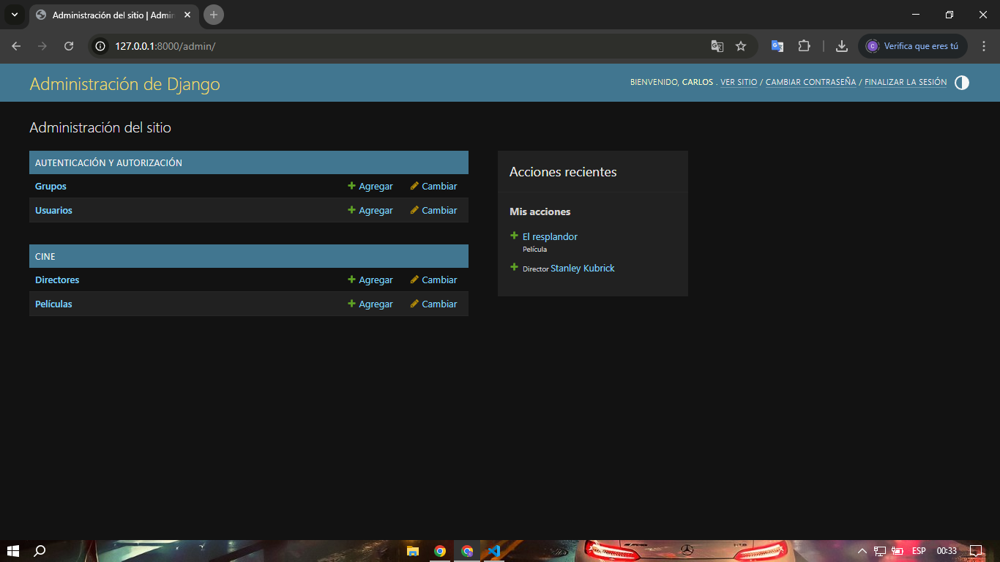
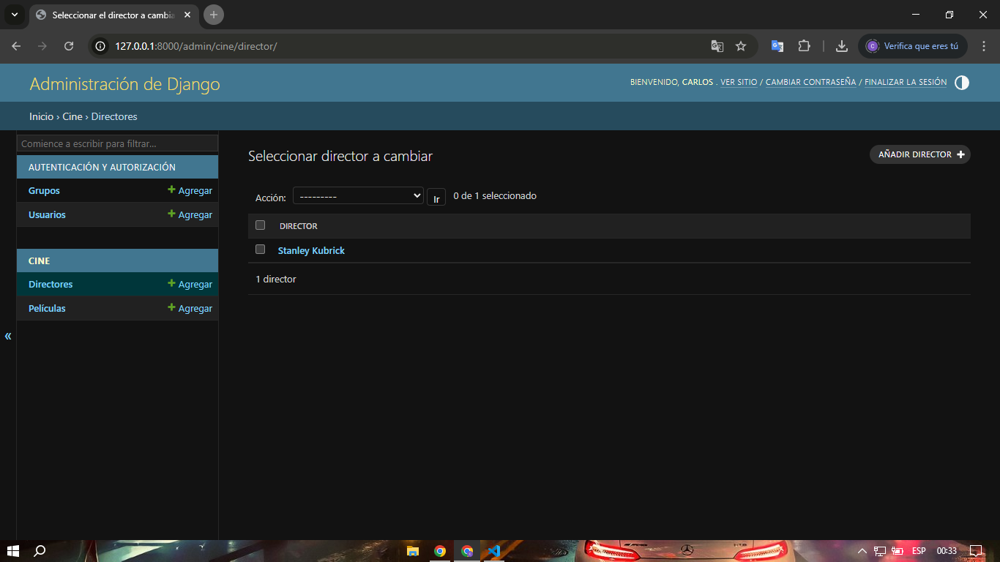
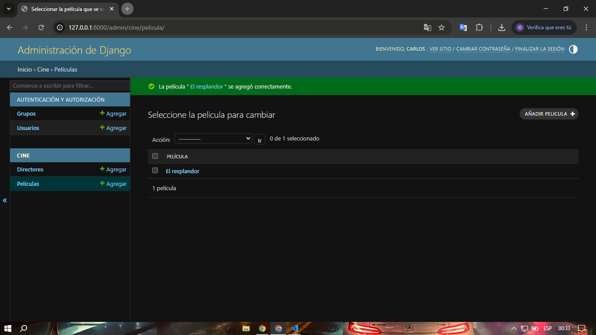

# pg2_parcial_p2

# Reutilización de Código con Frameworks

## Información del estudiante

- **Nombre:** Carlos Marcelo Quispe Gonzales
- **Curso:** PG2
- **Materia:** Programación II
- **Fecha:** 08/05/2025

---

## Capturas de pantalla

### Panel de administración principal

### Registro de Director

### Registro de Película

